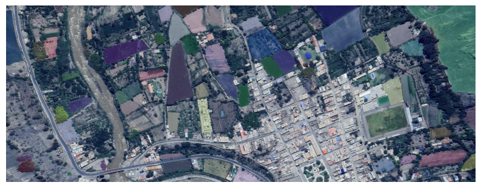
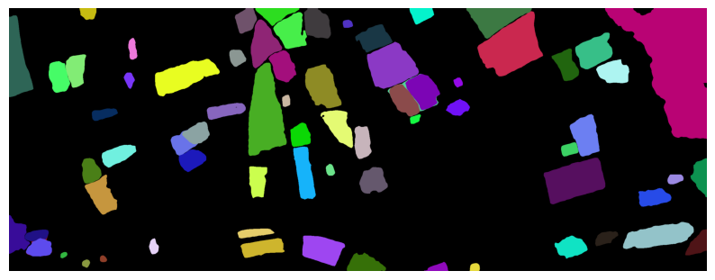

# Segmentación de Imágenes Satelitales con SAM

Proyecto de visión por computadora aplicado a imágenes satelitales usando **Segment Anything Model (SAM)** de Meta AI, ejecutado en Google Colab con GPU T4.

## Descripción

Este proyecto implementa segmentación automática de regiones sobre imágenes satelitales utilizando el modelo SAM (`vit_b`) de Facebook Research. El objetivo es identificar y delimitar zonas geográficas de forma automática a partir de imágenes aéreas/satelitales, aplicando técnicas de visión por computadora con deep learning.

## Tecnologías utilizadas

- **Python**
- **PyTorch** — carga y ejecución del modelo SAM en GPU
- **Segment Anything Model (SAM)** — modelo de segmentación de Meta AI
- **OpenCV** — procesamiento y transformación de imágenes
- **NumPy** — manipulación de arrays y máscaras
- **Matplotlib** — visualización de resultados
- **Google Colab** — entorno de ejecución con GPU T4

## ¿Cómo funciona?

1. Se carga una imagen satelital en formato PNG
2. Se inicializa el modelo SAM (`vit_b`) con checkpoint preentrenado
3. Se ejecuta `SamAutomaticMaskGenerator` para detectar regiones automáticamente
4. Cada región detectada recibe una máscara con color aleatorio
5. Se visualiza el resultado con overlay de segmentos sobre la imagen original

## Resultados

El modelo detecta automáticamente múltiples segmentos geográficos (vegetación, suelo, agua, infraestructura) sin necesidad de etiquetado manual previo, lo que lo hace útil para análisis preliminar de imágenes satelitales en proyectos de minería, infraestructura y planificación territorial.

### Imagen segmentada con overlay de máscaras



### Segmentos coloreados por región



## Estructura del proyecto

```
satellite-image-segmentation-sam/
│
├── Segmentacion_de_Imagenes_Satelitales_con_SAM.ipynb   # Notebook principal
├── imagen.png                                            # Imagen satelital de entrada
└── README.md
```

## Cómo ejecutar

1. Abre el notebook en Google Colab
2. Activa GPU: `Runtime > Change runtime type > T4 GPU`
3. Ejecuta las celdas en orden
4. El modelo se descarga automáticamente (~375 MB)

```python
# El modelo se carga así:
model_type = "vit_b"
sam_checkpoint = "sam_vit_b_01ec64.pth"
device = "cuda" if torch.cuda.is_available() else "cpu"
sam = sam_model_registry[model_type](checkpoint=sam_checkpoint)
sam.to(device=device)
```

## Contexto

Este proyecto forma parte de mi exploración en visión por computadora aplicada a datos geoespaciales, combinando mi experiencia previa en análisis de datos satelitales (LANDSAT, LiDAR) con modelos modernos de segmentación de imágenes.

## Referencias

- [Segment Anything Model (SAM) — Meta AI](https://github.com/facebookresearch/segment-anything)
- [SAM Paper — Kirillov et al., 2023](https://arxiv.org/abs/2304.02643)

## Autor

**Gian Carlos Paucar Cortez**  
[linkedin.com/in/gian-pc](https://linkedin.com/in/gian-pc) | [github.com/gian-pc](https://github.com/gian-pc)